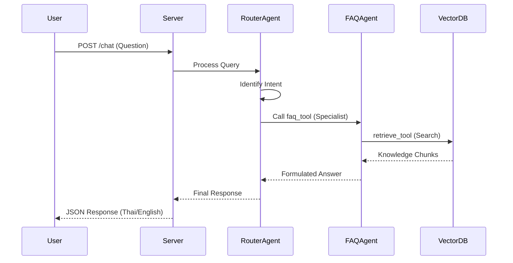

# 🏗️ MiMi AI: Architecture Guide

This guide explains the inner workings of the MiMi AI engine, focusing on its multi-agent orchestration and Retrieval-Augmented Generation (RAG) system.

## 🧱 Core Components

MiMi AI is built on a modular architecture that separates the API layer, the brain (agents), and the knowledge base.

### 1. API Layer (`AI/server.py`)
The gateway to the engine. It uses **FastAPI** to expose a `/chat` endpoint.
- **Input**: Platform User ID, Conversation ID, and the User message.
- **Process**: Initializes or retrieves a session, then hands off the query to the **Root Agent**.
- **Output**: Agent response and token usage metrics.

### 2. The Orchestrator: Router Agent (`AI/app/agents/multi/router_agent.py`)
Instead of a single "do-it-all" model, MiMi uses a **Router Agent**.
- **Role**: Understanding user intent.
- **Tool Use**: If a question is about products or FAQs, it calls the `faq_tool`.
- **Instruction**: Driven by `AI/app/prompts/router.yaml`.

### 3. The Specialist: FAQ Agent (`AI/app/agents/multi/faq_agent.py`)
A dedicated agent specialized in brand knowledge.
- **Dynamic Loading**: Can be specialized for different brands (e.g., MizuMi) by loading specific YAML instructions.
- **Knowledge Retrieval**: Uses a brand-specific version of the `retrieve_tool` to fetch facts from the vector index.

### 4. Knowledge Retrieval (`AI/app/retrieval.py` & `AI/app/tools/faq_tools.py`)
The "memory" of the system.
- **Vector DB**: Uses **FAISS** to store and search through embeddings of the brand's knowledge base.
- **Semantic Search**: Finds relevant chunks of text even if the keywords don't match exactly.

---

## 🔄 Data Flow

---

## 💾 Session Management
MiMi uses `InMemorySessionService` to maintain conversation context. This allows agents to remember previous parts of the chat, enabling a natural, continuous skincare consultation journey.

## 🛠️ Key Technologies
- **LLM**: Google Gemini 2.0 Flash (latest `gemini-3-flash-preview` for high speed).
- **Embeddings**: Google Gemini Embedding models.
- **Vector Search**: FAISS (Facebook AI Similarity Search).
- **Framework**: FastAPI with Asynchronous support.
- **Configuration**: YAML-based prompts for easy persona management.
